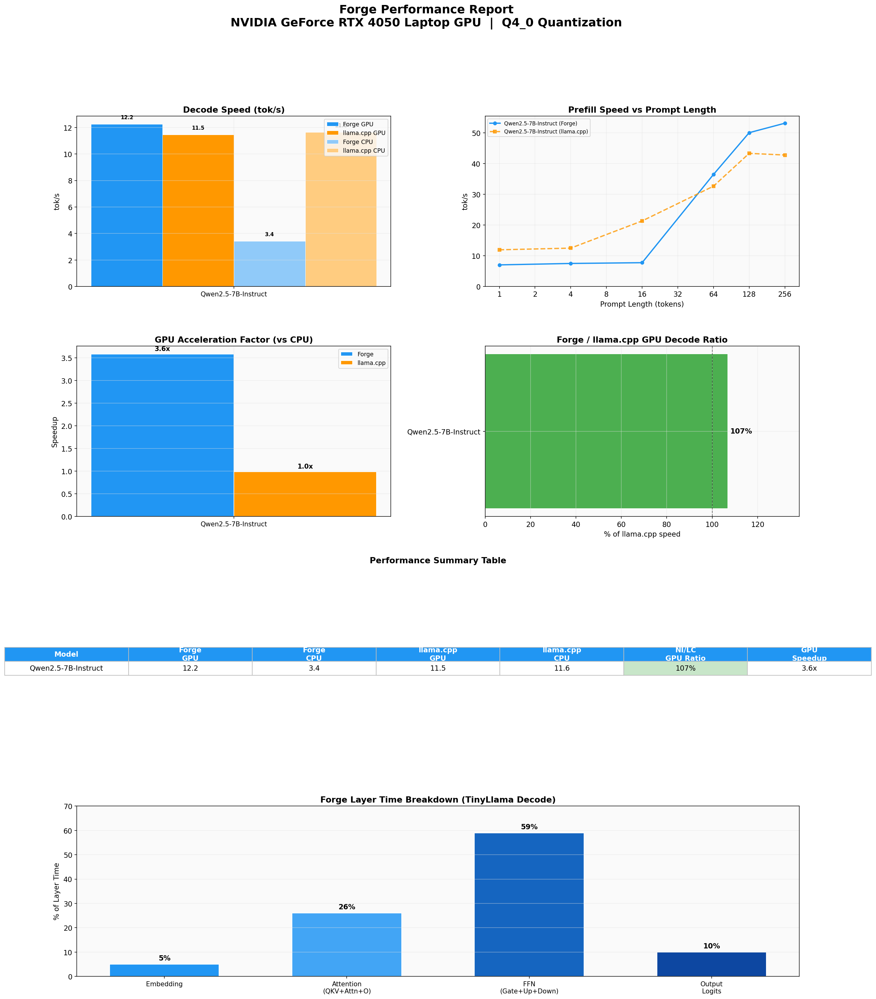

<p align="center">
  
</p>

<h1 align="center">Forge</h1>

<p align="center">
  <strong>Lightweight LLM Inference Engine</strong> — Pure C++/CUDA, No Heavy Dependencies
</p>

<p align="center">
  English | <a href="README_zh.md">中文</a>
</p>

<p align="center">
  
  
  
  
</p>

---

## Demo

<p align="center">
  
</p>

---

## Description

Forge is a lightweight LLM inference engine written from scratch in C++ and CUDA. The main goal is to provide a minimal, transparent, and high-performance inference stack — no PyTorch, no TensorFlow, no heavy framework dependencies.

- Plain C++/CUDA — zero dependency on ML frameworks
- Hand-written CUDA kernels (GEMM, GEMV, flash attention, RMS norm, RoPE, etc.)
- Hand-tuned AVX2 kernels with OpenMP parallelism
- Q4_0, Q4_1, Q4_K, Q6_K, Q8_0 quantization
- cuBLAS / OpenBLAS optional — default OFF, pure custom kernels used instead
- Supports LLaMA, DeepSeek (MLA), Qwen3.5 (Hybrid SSM+Attention), MiniCPM-V (multimodal)

---

## Quick start

```bash
git clone https://github.com/your-org/Forge.git
cd Forge

cmake -B build && cmake --build build -j

# CLI inference
./build/forge-cli -m model.gguf -p "Hello" --stream

# Python inference
python examples/qwen_inference.py --model-path model.gguf --device cuda
```

**Dependencies**: CMake ≥ 3.18, CUDA Toolkit, Python 3 (NumPy)

### Python API

```python
import forge

model = forge.Model("model.gguf", device="cuda")
tokenizer = forge.Tokenizer("model.gguf")

tokens = tokenizer.encode("Hello, world!")
result = model.generate(tokens, max_new_tokens=128)
print(tokenizer.decode(result))
```

### CLI

```bash
# Interactive chat
./build/forge-cli -m model.gguf --stream

# One-shot generation
./build/forge-cli -m model.gguf -p "Once upon a time" -n 128
```

---

## Build options

| Option | Default | Description |
|--------|---------|-------------|
| `USE_CUDA` | ON | Enable CUDA backend (requires CUDA Toolkit) |
| `USE_CUBLAS` | ON | Use cuBLAS for GPU GEMM; OFF uses pure CUDA tiled GEMM |
| `USE_OPENBLAS` | OFF | Use OpenBLAS for CPU FP32 GEMM; default uses hand-tuned AVX2 kernels |

```bash
# Pure custom CUDA kernels, no cuBLAS
cmake -B build -DUSE_CUBLAS=OFF

# Enable OpenBLAS for CPU FP32 matmul
cmake -B build -DUSE_OPENBLAS=ON

# Fully self-contained build
cmake -B build -DUSE_CUBLAS=OFF -DUSE_OPENBLAS=OFF
```

---

## Supported architectures

| Architecture | Example Models | Attention | Multimodal |
|-------------|---------------|-----------|------------|
| LLaMA | TinyLlama, Qwen2.5 | GQA | ❌ |
| DeepSeek | DeepSeek-V2/V3, DeepSeek-R1 | MLA | ❌ |
| Qwen3.5 | Qwen3.5-MoE | Hybrid (Attention + SSM) | ❌ |
| MiniCPM-V | MiniCPM-V 4.6 | GQA | ✅ VLM |

<details>
<summary>Operation details</summary>

| Operation | GPU (CUDA) | CPU |
|-----------|-----------|-----|
| Matrix multiply (FP32) | cuBLAS GEMM or tiled GEMM kernel | OpenBLAS or AVX2 gemm |
| Matrix multiply (quantized) | Fused dequant + GEMV kernel | Fused dequant + GEMV AVX2 |
| Flash attention | Custom CUDA kernel | AVX2 + OpenMP |
| RMS norm | Custom CUDA kernel | AVX2 + OpenMP |
| RoPE | Custom CUDA kernel | AVX2 |
| SiLU / GELU | Custom CUDA kernel | AVX2 polynomial |
| Sampler (argmax) | Custom CUDA kernel | AVX2 reduction |
| Embedding | Custom CUDA kernel | Pure C++ |
| KV cache | cudaMemcpy | memcpy |

</details>

---

## Performance

Detailed benchmark reports (Forge vs llama.cpp, GPU & CPU) are generated via the `report/` module and stored in `resource/reports/`.

### Qwen2.5-7B-Instruct Q4_0 (RTX 4050 Laptop)

<p align="center">
  
</p>

<details>
<summary>Notes</summary>

- Measured with 100-token decode, prompt lengths 1–256
- CPU backend: AVX2 + 16 threads
- GPU backend: CUDA (cuBLAS offloaded)
- Quantized GEMV kernels (Q4_0 decode path) bypass cuBLAS entirely — cuBLAS is only used for FP32 GEMM (M > 1, non-quantized weights)
- OpenBLAS only affects CPU FP32 GEMM paths; quantized GEMV paths use hand-tuned AVX2 kernels
- GPU baseline includes CUDA kernel warmup

</details>

> Run `python -m report.runner` to regenerate benchmarks on your hardware.

---

## Backends

| Backend | Target |
|---------|--------|
| CUDA | NVIDIA GPU |
| AVX2 | x86-64 CPU |
| OpenMP | CPU (threading) |
| cuBLAS (optional) | NVIDIA GPU (FP32 GEMM) |
| OpenBLAS (optional) | CPU (FP32 GEMM) |

## Documentation

- [Build guide](docs/build.md)
- [Dependencies](docs/dependencies.md)
- [Python API](docs/python_api.md)
- [CLI usage](docs/cli.md)
- [Supported models](docs/models.md)
- [Architecture](docs/architecture.md)

---

## Contributing

PRs welcome. See [CONTRIBUTING.md](CONTRIBUTING.md) for details.

---

## License

[MIT License](LICENSE)
