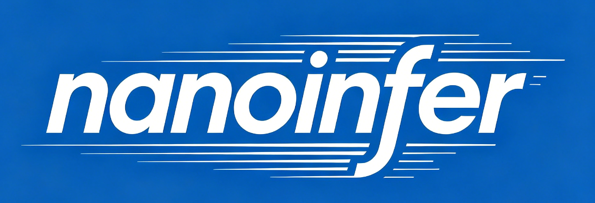
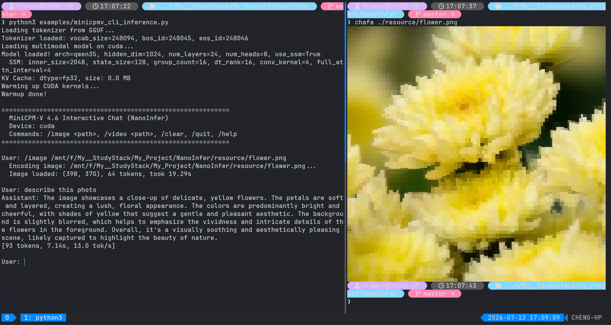
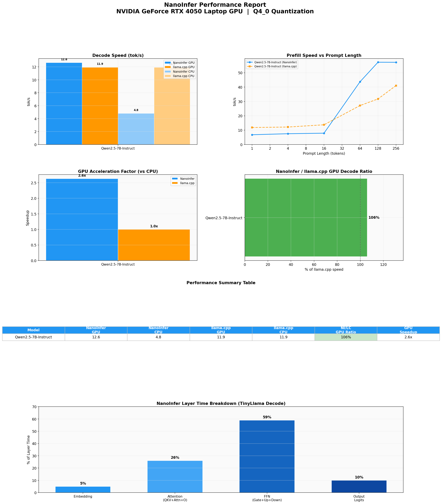

<p align="center">
  
</p>

<h1 align="center">NanoInfer</h1>

<p align="center">
  <strong>轻量级 LLM 推理引擎</strong> — 纯 C++/CUDA，无重型依赖
</p>

<p align="center">
  <a href="README.md">English</a> | 中文
</p>

<p align="center">
  
  
  
  
</p>

---

## 演示

<p align="center">
  
</p>

---

## 简介

NanoInfer 是一个纯 C++/CUDA 从零实现的轻量级 LLM 推理引擎。核心理念是提供一套极简、透明、高性能的推理栈，无需依赖 PyTorch、TensorFlow 等重型框架。

- 纯 C++/CUDA — 不依赖任何 ML 框架
- 手写 CUDA kernel：GEMM、GEMV、Flash Attention、RMS Norm、RoPE 等
- 手调 AVX2 CPU kernel，配合 OpenMP 并行
- Q4_0、Q4_1、Q4_K、Q6_K、Q8_0 量化格式
- cuBLAS / OpenBLAS 可选 — 默认关闭，使用纯自研 kernel
- 支持 LLaMA、DeepSeek（MLA）、Qwen3.5（Hybrid SSM+Attention）、MiniCPM-V（多模态）

---

## 快速开始

```bash
git clone https://github.com/your-org/NanoInfer.git
cd NanoInfer

cmake -B build && cmake --build build -j

# CLI 推理
./build/nanoinfer-cli -m model.gguf -p "你好" --stream

# Python 推理
python examples/qwen_inference.py --model-path model.gguf --device cuda
```

**依赖**: CMake ≥ 3.18, CUDA Toolkit, Python 3 (NumPy)

### Python API

```python
import nanoinfer

model = nanoinfer.Model("model.gguf", device="cuda")
tokenizer = nanoinfer.Tokenizer("model.gguf")

tokens = tokenizer.encode("你好，世界！")
result = model.generate(tokens, max_new_tokens=128)
print(tokenizer.decode(result))
```

### CLI

```bash
# 交互式对话
./build/nanoinfer-cli -m model.gguf --stream

# 单次生成
./build/nanoinfer-cli -m model.gguf -p "从前有座山" -n 128
```

---

## 编译选项

| 选项 | 默认 | 说明 |
|------|------|------|
| `USE_CUDA` | ON | 启用 CUDA 后端（需 CUDA Toolkit） |
| `USE_CUBLAS` | ON | 使用 cuBLAS 做 GPU GEMM；OFF 则用纯 CUDA tiled GEMM |
| `USE_OPENBLAS` | OFF | 使用 OpenBLAS 做 CPU FP32 GEMM；默认用手调 AVX2 kernel |

```bash
# 纯自研 CUDA kernel，完全不依赖 cuBLAS
cmake -B build -DUSE_CUBLAS=OFF

# 启用 OpenBLAS 加速 CPU FP32 矩阵乘
cmake -B build -DUSE_OPENBLAS=ON

# 完全自包含编译
cmake -B build -DUSE_CUBLAS=OFF -DUSE_OPENBLAS=OFF
```

---

## 支持架构

| 架构 | 代表模型 | 注意力 | 多模态 |
|------|---------|--------|-------|
| LLaMA | TinyLlama, Qwen2.5 | GQA | ❌ |
| DeepSeek | DeepSeek-V2/V3, DeepSeek-R1 | MLA | ❌ |
| Qwen3.5 | Qwen3.5-MoE | Hybrid (Attention + SSM) | ❌ |
| MiniCPM-V | MiniCPM-V 4.6 | GQA | ✅ VLM |

<details>
<summary>算子实现详情</summary>

| 算子 | GPU (CUDA) | CPU |
|------|-----------|-----|
| 矩阵乘 (FP32) | cuBLAS GEMM 或 tiled GEMM kernel | OpenBLAS 或 AVX2 gemm |
| 矩阵乘 (量化) | 融合去量化 + GEMV kernel | 融合去量化 + GEMV AVX2 |
| Flash Attention | 自研 CUDA kernel | AVX2 + OpenMP |
| RMS Norm | 自研 CUDA kernel | AVX2 + OpenMP |
| RoPE | 自研 CUDA kernel | AVX2 |
| SiLU / GELU | 自研 CUDA kernel | AVX2 多项式近似 |
| Sampler (argmax) | 自研 CUDA kernel | AVX2 归约 |
| Embedding | 自研 CUDA kernel | 纯 C++ |
| KV Cache | cudaMemcpy | memcpy |

</details>

---

## 性能

详细 benchmark 报告（NanoInfer vs llama.cpp, GPU & CPU）由 `report/` 模块生成，保存在 `resource/reports/` 下。

### Qwen2.5-7B-Instruct Q4_0 (RTX 4050 Laptop GPU)

<p align="center">
  
</p>

<details>
<summary>说明</summary>

- 测试条件：100-token decode，prompt 长度 1–256
- CPU 后端：AVX2 + 16 线程
- GPU 后端：CUDA（cuBLAS offloaded）
- 量化 GEMV kernel（Q4_0 decode 路径）不经过 cuBLAS — 仅在 FP32 GEMM 时使用
- GPU 基线包含 CUDA kernel warmup

</details>

> 运行 `python -m report.runner` 可在你的硬件上重新生成 benchmark。

---

## 后端支持

| 后端 | 目标设备 |
|------|---------|
| CUDA | NVIDIA GPU |
| AVX2 | x86-64 CPU |
| OpenMP | CPU（多线程） |
| cuBLAS（可选） | NVIDIA GPU（FP32 GEMM） |
| OpenBLAS（可选） | CPU（FP32 GEMM） |

## 文档

- [构建指南](docs/build_zh.md)
- [依赖说明](docs/dependencies_zh.md)
- [Python API](docs/python_api_zh.md)
- [CLI 使用](docs/cli_zh.md)
- [模型支持](docs/models_zh.md)
- [架构设计](docs/architecture_zh.md)

---

## 贡献

欢迎提交 PR。详见 [CONTRIBUTING.md](CONTRIBUTING.md)。

---

## 许可证

[MIT License](LICENSE)
